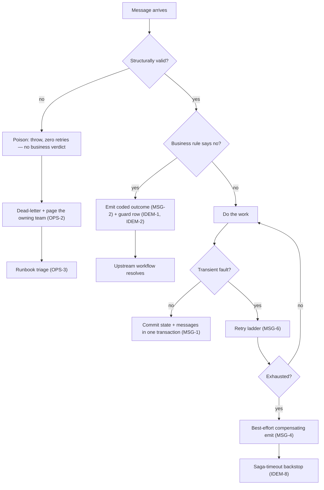

# Idempotency & Failure

> **Read this first — which identity do you dedup on?** Every dedup guard in this chapter stores an id and refuses to act on the same id twice. The design question is *which id*, because the id decides which duplicates get caught:
>
> | | Envelope id (minted per send) | Operation key (minted once per intent) |
> |---|---|---|
> | Typical names | Broker / transport `MessageId` | `Idempotency-Key`, a persisted event id, a natural key |
> | Minted by | The messaging infrastructure, fresh at every send | The originator of the intent: the caller at the door, or the producer at decision time |
> | Catches | Redelivery of that envelope | Every envelope carrying the same intent: re-sends, re-emits, replays, retries across channels |
> | Misses | A logical duplicate in a fresh envelope — a producer retry, a reaper re-emit (IDEM-8), a republishing hand-replay (OPS-3) | Nothing in its scope — but it exists only where someone minted or derived it |
> | Retention | The redelivery window (the framework inbox) | The operation's lifetime: the caller's retry horizon, or effectively forever for a natural key |
>
> The dividing line is **mint-time, not the field's name**. An id stamped at *send* time identifies the envelope. An id minted at *decision* time and persisted with the fact identifies the operation — every later re-send carries it unchanged. An event id can be either: minted per publish, it is just an envelope id; minted once and stored with the fact (MSG-1), it is an idempotency key in all but name, and consumer dedup on it suppresses logical duplicates, not merely redelivery. This is why IDEM-1's table separates the framework inbox (envelope id, short window) from the application dedup row (stable id, beyond any window).
>
> Within the operation-key column, derivation is the second choice (IDEM-3). A **caller-supplied random token** names the intent exactly and never rejects a legitimate repeat — but it exists only where the caller cooperates. A **natural / business key** ("one renewal per subscription per period") needs no cooperation and catches duplicates on every channel — but it collapses legitimately repeated operations into one; reserve it for operations that are genuinely unrepeatable. "Identical parameters don't necessarily indicate identical intent" (AWS).
>
> One mechanism is deliberately absent from this comparison: the optimistic-concurrency token. It arbitrates two *different* operations racing for one row; it cannot suppress the *same* operation arriving twice (CON-1's trap).
>
> *Further reading: [the IETF Idempotency-Key draft](https://datatracker.ietf.org/doc/draft-ietf-httpapi-idempotency-key-header/); [AWS, "Making retries safe with idempotent APIs"](https://aws.amazon.com/builders-library/making-retries-safe-with-idempotent-APIs/); [Dochia, "Idempotency Is Easy Until the Second Request Is Different"](https://blog.dochia.dev/blog/idempotency/) — one operation identity propagated across boundaries.*

### IDEM-1 · Every message will eventually arrive twice — write every consumer so the second arrival changes nothing [MUST]

**Rule.** Every consumer must tolerate at-least-once redelivery. Choose the guard by the **effect's lifetime and where the duplicate can come from** — cheapest sufficient guard first, per the table below. Remember that duplicates also arrive from *outside* any inbox window: a dead-letter hand-replay, an operator re-run, a reaper re-emit (OPS-3). Prefer the framework's built-in dedup where its window genuinely covers the hazard; don't hand-roll what it provides.

| Effect / hazard shape | Guard | Why this guard | Retention |
|---|---|---|---|
| Read-only, or naturally idempotent (set-to-value) | None | A duplicate re-produces the same state; a guard is pure cost | — |
| Monotonic transition; re-running from the same pre-state is harmless | State guard: no-op unless the entity is in the expected pre-state | The entity's own state *is* the dedup record — no extra row, no window | None — lives on the entity |
| Non-monotonic transition; a stale duplicate could undo newer progress | State guard widened to the correlation key (a discriminator on the subject) | Pre-state alone can't tell "retry of this" from "stale message about a superseded subject" | None — lives on the entity |
| Unrepeatable effect; duplicates plausible only within transport redelivery | Framework durable inbox (dedup by message id) | Already built, already transactional — don't hand-roll what the framework provides | Framework window — typically minutes after handling; verify the default |
| Unrepeatable effect; duplicates possible *beyond* any window (dead-letter hand-replay, operator re-run, reaper re-emit) | Application dedup row keyed on a business id, written as INSERT (IDEM-2; key chosen per IDEM-3) | Only a durable row you own outlives the inbox window; the PK collision closes the race | Explicit policy — at least as long as a replay is possible; unbounded-by-default is the trap |
| The outcome itself must be queryable or reportable | Dedup row elevated to a first-class outcome entity (IDEM-5) | A guard row doubling as the outcome log serves neither role well | Domain-driven — the audit horizon |
| Synchronous client double-submit at the HTTP door | Client-supplied idempotency key replaying the stored response (IDEM-3, IDEM-10) | No message id exists yet at the door; only the caller can name the retry | At least the client's retry horizon |

Guards compose: one operation may need the door key *and* a consumer-side guard — each entry boundary that can redeliver gets its own, **added only where a duplicate at that boundary is genuinely costly**. Every guard row is born with a declared retention derived from its hazard window (OPS-4).

**Why.** A doubled effect — a card charged twice, an item shipped twice — is the worst failure a consumer can produce. But don't hand-roll dedup the framework's inbox already gives you.

**When not to apply.** A read-only or naturally idempotent consumer needs no guard at all.

*Sketch: Appendix A1.*

**Sources.** [Hohpe & Woolf — Idempotent Receiver](https://www.enterpriseintegrationpatterns.com/patterns/messaging/IdempotentReceiver.html); [Richardson, "Handling duplicate messages using the Idempotent Consumer pattern"](https://microservices.io/post/microservices/patterns/2020/10/16/idempotent-consumer.html).

### IDEM-2 · Write an application-level dedup guard as an INSERT so a true race fails loud [MUST]

**Rule.** If you keep an application-level dedup record, persist it with insert semantics (not upsert), so a request that races past the in-handler check collides on the primary key at commit and rolls the whole transaction back. The lookup is the fast path; the PK violation is the backstop that closes the check-then-act window without a lock.

**⚠ Trap:** The guard only closes the race if the side effect and the guard row commit in **one transaction**. Split them across stores and the gap reopens — the PK collision then rolls back only the guard, not the effect.

**Why.** The cheap up-front check has a race window under concurrency; the PK collision guarantees exactly-once side effects even under truly parallel duplicates.

**When not to apply.** The framework's durable inbox handles its own race; this rule governs app-level guards only.

*Sketch: Appendix A1.*

**Sources.** [Brandur, "Implementing Stripe-like Idempotency Keys in Postgres"](https://brandur.org/idempotency-keys).

### IDEM-3 · Dedup on the message id or a client token — a business key only when the operation is truly unrepeatable [SHOULD]

**Rule.** Dedup consumers on the **message's own stable id** — an id the producer mints once and persists with the fact, carried unchanged on every re-send (Richardson's *Idempotent Consumer*; Hohpe's *Idempotent Receiver*). Make synchronous APIs idempotent on a **client-supplied surrogate token** (Stripe's random key; AWS's client request token) — *not* derived from request content. Use a **business / natural key only when the operation is genuinely unrepeatable** (one record per real-world entity).

**⚠ Trap:** Mint-time decides what an id identifies. The broker's built-in message id is stamped fresh at every send, so it identifies the *envelope*: it catches redelivery (IDEM-1's inbox row), but a producer retry, a reaper re-emit (IDEM-8), or a republishing hand-replay (OPS-3) arrives with a new one and walks straight past the guard. An id minted once at decision time and stored with the fact identifies the *operation* — every re-send carries it, so dedup on it suppresses logical duplicates too.

**Why.** "Identical parameters don't necessarily indicate identical intent" (AWS) — a content / natural key silently rejects legitimately-distinct repeats (the same parties doing the same thing twice on purpose).

**Decision criteria (it depends).** Is the operation naturally unrepeatable? Is there a stable external / caller-supplied request id? What is the cost of a *false-duplicate rejection*?

**Sources.** [microservices.io — Idempotent Consumer](https://microservices.io/patterns/communication-style/idempotent-consumer.html); [Stripe idempotent requests](https://docs.stripe.com/api/idempotent_requests); [Hohpe & Woolf — Idempotent Receiver](https://www.enterpriseintegrationpatterns.com/patterns/messaging/IdempotentReceiver.html); [AWS Builders' Library — "Making retries safe with idempotent APIs"](https://aws.amazon.com/builders-library/making-retries-safe-with-idempotent-APIs/); Microsoft Azure Functions idempotency.

*Sketch: Appendix A1.*

### IDEM-4 · Poison is a bug to investigate; a business "no" is an outcome to record — route them differently [MUST]

**Rule.** Classify every consumer failure as one of two things. **Structurally invalid** is poison: malformed or incoherent input that no retry can fix. Throw, dead-letter it with zero retries for human investigation, and issue **no** domain verdict. A **legitimate business outcome** is not an exception at all: emit a coded result, record the guard row, and drive a state transition. Dead-letter poison with a **visible move-to-error-queue, never a silent discard** — visible per OPS-2 — and never use a discarding validation framework to guard a consumer (if it drops invalid messages, poison vanishes instead of being investigated). Use the framework's *move-to-error-queue* policy, never its *discard*.

The routing at a glance (transient leg per MSG-4 and MSG-6; backstop per IDEM-8):

**Why.** Retrying poison burns attempts and clogs the queue; treating a business "no" as an exception dead-letters normal outcomes and strands the upstream flow. *Example: a refund instruction naming an account that doesn't exist is poison to investigate; a refund exceeding the available balance is a business "no" the workflow must hear.*

**When not to apply.** The boundary needs per-case judgment (a missing-by-id reference is poison; the same lookup "not found" by reference may be a benign no-op). Mis-classifying either way is the bug.

*Sketch: Appendix A4.*

**Sources.** [Hohpe & Woolf — Invalid Message Channel](https://www.enterpriseintegrationpatterns.com/patterns/messaging/InvalidMessageChannel.html) and [Dead Letter Channel](https://www.enterpriseintegrationpatterns.com/patterns/messaging/DeadLetterChannel.html).

### IDEM-5 · The dead-letter queue is for investigation, not the system of record [SHOULD]

**Rule.** Don't treat the DLQ as the record of outcomes. Business outcomes — including failures the system understood and decided — are recorded as **first-class domain rows/events**; only genuinely unexpected, unfixable inputs land in the DLQ for a human — who is paged per OPS-2 and follows the runbook of OPS-3. Elevate the outcome to a first-class entity rather than letting a dedup row double as the outcome log.

**Why.** Outcomes buried in a DLQ are invisible to the domain, unqueryable, and lost on purge; a recorded coded result is durable, auditable, and actionable. (Messaging frameworks treat their DLQ as a diagnostic store, not a business-event log — recording outcomes is your responsibility.)

**When not to apply.** A small system may accept the dedup row plus emitted event as the outcome trail; elevate to a dedicated outcome entity when you need to query or report on outcomes.

*Sketch: Appendix A4.*

**Sources.** [Hohpe & Woolf — Dead Letter Channel](https://www.enterpriseintegrationpatterns.com/patterns/messaging/DeadLetterChannel.html) (a diagnostic store, not a record).

### IDEM-6 · On an optimistic-concurrency retry, re-read fresh state and re-decide — don't blindly replay [MUST]

**Rule.** When a concurrency conflict triggers an automatic retry, the retry reloads current state and re-evaluates the decision — it does not replay the original intent. Build handlers around "load current → check → mutate," never "apply the inbound delta."

**Why.** The value of optimistic-concurrency-plus-retry is that the second attempt sees the world the winner left behind and can reach a different, correct outcome (e.g. resolve to a clean rejection because the resource is now gone) instead of double-applying or throwing raw.

**When not to apply.** Read-modify-write handlers get this for free; pure-delta handlers must be restructured around load-check-mutate first.

*Sketch: Appendix A5.*

**Sources.** [Khononov, "Event-Driven Architecture on AWS, Part III"](https://vladikk.com/2024/10/13/aws-eda-iii/) (version checks make consumer dedup crash-safe).

### IDEM-7 · A stale read is retryable, an illegal operation is final — tell them apart with 412 vs 409 [SHOULD]

**Rule.** Distinguish two failures: "your read was stale — the row moved under you," which is retryable (re-fetch and try again), from "this operation isn't legal in the current state," which is a terminal business outcome. Map them to different status codes so the client knows which reaction is correct: a stale precondition or concurrency conflict returns **412**; an operation illegal in the current state returns **409**.

**Why.** Same conflict, opposite client reactions — a client retrying a 409 loops forever (the state never returns); one treating a 412 as terminal abandons a write that would have succeeded on re-read. The status code is the contract that disambiguates.

**When not to apply.** RFC-9110 treats 412 strictly as a *client-stated* precondition, so reusing it for a server-side concurrency backstop (no `If-Match` sent) is a documented stretch; if that bothers your API consumers, use 409 with a concurrency problem-detail for the server-side case and reserve 412 for when the client actually sent a precondition. The 412 also omits the current version, forcing a blind re-fetch.

**Sources.** [RFC 9110 — HTTP Semantics](https://www.rfc-editor.org/rfc/rfc9110) (412, 409, preconditions).

### IDEM-8 · Backstop awaited replies with a saga timeout; use a reaper only for stranded state no saga watches [MUST]

**Rule.** When a workflow step awaits a reply that may never come, backstop it with a **framework-native saga timeout** — a scheduled timeout message correlated to the saga, declarative and idiomatic. A periodic **reaper** is the *secondary* net, for stranded state no specific saga is awaiting: lost messages, cold-start races, lost compensating emits. The reaper re-derives the work from the durable record, drives it to a safe terminal state idempotently, and commits through the outbox. It also restores the original correlation id from the durable record onto anything it re-emits — a re-emit has no inbound message to copy context from (OPS-1).

**⚠ Trap:** The reaper is itself a concurrent writer. It needs its own idempotent, race-safe path — state-guarded transitions, committed through the outbox — or the safety net manufactures the very double effects it exists to prevent.

**Why.** A saga timeout resolves "the reply never arrived" precisely and declaratively; the reaper cleans up the broader leftovers that no single timeout is watching. *Example: a payment provider's callback never arrives; without a timeout the order waits in "awaiting payment" forever.*

**When not to apply.** A saga adds a small stateful coordinator (mild orchestration — see ARCH-11). A reaper trades latency for safety — stranded state lingers until the next sweep, unacceptable for tight SLAs — and treats symptoms, not causes.

**Sources.** [microservices.io — Saga](https://microservices.io/patterns/data/saga.html); [Hohpe & Woolf — Process Manager](https://www.enterpriseintegrationpatterns.com/patterns/messaging/ProcessManager.html); [Microsoft — Saga pattern](https://learn.microsoft.com/en-us/azure/architecture/patterns/saga), [Scheduler Agent Supervisor pattern](https://learn.microsoft.com/en-us/azure/architecture/patterns/scheduler-agent-supervisor).

### IDEM-9 · Background jobs don't get the outbox for free — enroll them in the transaction explicitly [MUST]

**Rule.** Code that publishes messages from a hosted background loop must use the same transactional-outbox enrollment as request-scoped code. A bare message-bus handle in a background scope sends *outside* the database transaction and can emit a message whose row write later rolls back — a silent trap the happy path never hits. (Frameworks auto-enroll request/message handlers only; a background scope must call the outbox-enrollment API explicitly and flush messages with the save.)

**Why.** A real conservation hazard — a message with no committed state change — is produced by exactly this asymmetry, and only adversarial review or production catches it.

**When not to apply.** The exact mechanism is framework-specific, but the general trap — "background work skips the ambient transactional wiring request handlers get for free" — is broad. Always verify background work enrolls in the outbox.

### IDEM-10 · Validate at the front door: one consistent 4xx error shape, and size limits declared in the contract [MUST]

**Rule.** The synchronous entry point validates every request before any state is touched or any message is minted. Check structure — required fields, types, ranges — and check **bounds**: maximum collection sizes, payload lengths, and cardinalities, declared as part of the API contract, not discovered later as a 500 or a poison message. Bounds include **arrival rate**: the door ships with an admission ceiling — a request-rate or concurrency limit that sheds excess with a 429, a stable code, and a `Retry-After`. "Admit less work at the front door" is one of OPS-5's three backpressure levers, and it cannot be invented mid-incident: ship it now, default it generous, and test the rejection shape like any other 4xx (TEST-4). And bound responses as you bound requests: every collection-returning endpoint **paginates from day one** — pagination retrofitted onto a live endpoint is a breaking contract change, the one bound you cannot add later. Reject with the precise 4xx and **one consistent machine-readable error body** across all endpoints (e.g. a problem-details shape), carrying a stable code per violation — the synchronous twin of coded failure outcomes (MSG-2) — never a raw exception string. The door checks shape; the aggregate rules on business legality. An illegal transition is the aggregate's verdict, mapped to a status code per IDEM-7 — never a rule duplicated into a request validator, where it will drift.

**⚠ Trap:** An unbounded collection accepted at the door becomes a multi-megabyte message and a hot row downstream — bounds are a correctness and availability control, not pedantry.

**Why.** Whatever the door rejects can never become a malformed message, so consumer poison handling (IDEM-4) stays reserved for genuine bugs rather than user typos. A stable error code is actionable by clients and tooling; free text pins them to a sentence. *Example: an order with 10,000 line items is accepted, serializes into a message the broker strains under, and contends one row for seconds; bounded at the door, it is a 400 with code `TooManyLines` the client can react to.*

**When not to apply.** Internal hops between your own services don't need the full ceremony — there the contract is the message plus its drift gate (TEST-1), and structural invalidity is poison (never a discarding validator — IDEM-4). Don't re-validate at the door what the type system already makes unrepresentable (ARCH-6).

**Sources.** [RFC 9457 — Problem Details for HTTP APIs](https://www.rfc-editor.org/rfc/rfc9457); [OWASP — Input Validation Cheat Sheet](https://cheatsheetseries.owasp.org/cheatsheets/Input_Validation_Cheat_Sheet.html); [Microsoft — Throttling pattern](https://learn.microsoft.com/en-us/azure/architecture/patterns/throttling), [Rate Limiting pattern](https://learn.microsoft.com/en-us/azure/architecture/patterns/rate-limiting-pattern).
